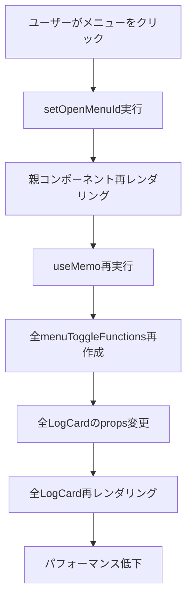
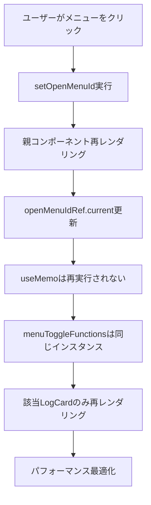

# useRefによる再レンダリング制御

- **学習日**: 2025/06/23
- **学習時間**: 80分
- **効果実感**: 4/5
- **効果の種類**: 理解が深まった

## 内容

# React パフォーマンス最適化の実践：useRefによる再レンダリング制御完全ガイド

## 🎯 はじめに

Reactアプリケーションにおいて、不要な再レンダリングはパフォーマンスの大敵です。特に大量のコンポーネントを表示するリスト画面では、一つの状態変更が全体の再レンダリングを引き起こし、ユーザー体験を大きく損ねることがあります。

今回は、学習ログアプリケーションでのメニュー開閉機能を例に、**useRefを活用した依存関係の最適化**について詳しく解説します。

## 🚨 問題の発見：メニュー開閉時の全コンポーネント再レンダリング

### 発生していた問題

```typescript
// ❌ 問題のあるコード（最適化前）
const menuToggleFunctions = useMemo(() => {
  const functions: Record<number, () => void> = {};
  logs.forEach((log) => {
    functions[log.id] = () => {
      const newMenuId = openMenuId === log.id ? null : log.id;
      setOpenMenuId(newMenuId);
    };
  });
  return functions;
}, [logs, setOpenMenuId, openMenuId]); // ← openMenuIdを依存配列に含む
```

**症状：**
- メニューを1回開閉する度に、全ての`LogCard`（10個以上）が再レンダリング
- UIの反応が重く、スクロールもカクつく
- 開発者ツールで大量の再レンダリングを確認

**根本原因：**
1. `openMenuId`が変更される度に`useMemo`が再実行
2. 全ての`menuToggleFunctions`が新しいインスタンスとして再作成
3. `React.memo`でも防げない（関数参照が毎回変わるため）

## 🔧 解決策：useRefによる依存関係の分離

### 最適化後のコード

```typescript
// ✅ 解決されたコード（最適化後）
// openMenuIdのRefを作成して依存を排除
const openMenuIdRef = useRef(openMenuId);
openMenuIdRef.current = openMenuId;

// 完全に安定したメニュートグル関数を作成
const menuToggleFunctions = useMemo(() => {
  const functions: Record<number, () => void> = {};
  logs.forEach((log) => {
    functions[log.id] = () => {
      const currentOpenMenuId = openMenuIdRef.current; // ← Refから最新値を取得
      const newMenuId = currentOpenMenuId === log.id ? null : log.id;
      setOpenMenuId(newMenuId);
    };
  });
  return functions;
}, [logs, setOpenMenuId]); // ← openMenuIdは依存配列から除外
```

## 🎭 useRefの仕組みと更新タイミング

### 1. Refの基本概念

```typescript
const openMenuIdRef = useRef(openMenuId);
openMenuIdRef.current = openMenuId;
```

この2行が実行されるタイミング：
- **初回レンダリング時**: `useRef(openMenuId)`でRefオブジェクト作成
- **毎回のレンダリング時**: `openMenuIdRef.current = openMenuId`で最新値に同期

### 2. 更新タイミングの詳細フロー

```typescript
// T0: 初期状態
// openMenuId = null (props)
// openMenuIdRef.current = null

// T1: ユーザーがメニュー123をクリック
const toggleFunction = () => {
  const currentOpenMenuId = openMenuIdRef.current; // null
  const newMenuId = currentOpenMenuId === 123 ? null : 123; // 123
  setOpenMenuId(123); // 親コンポーネントの状態更新をスケジュール
};

// T2: React バッチ処理
// 親コンポーネントの状態更新: openMenuId = null → 123

// T3: 親コンポーネント再レンダリング
// 新しいpropsでLogsSectionが呼び出される

// T4: LogsSection再レンダリング開始
function LogsSection({ openMenuId }) { // openMenuId = 123
  const openMenuIdRef = useRef(openMenuId);
  openMenuIdRef.current = openMenuId; // ← ここで123に更新！
  
  // useMemoは再実行されない（依存配列にopenMenuIdがないため）
  const menuToggleFunctions = useMemo(() => {
    // 既存の関数インスタンスがそのまま返される
  }, [logs, setOpenMenuId]);
}
```

### 3. なぜRefを使うのか：依存関係の分離

#### ❌ Refを使わない場合の問題

```typescript
// 問題：クロージャが作成時点の値をキャプチャ
const menuToggleFunctions = useMemo(() => {
  logs.forEach((log) => {
    functions[log.id] = () => {
      // この時点のopenMenuIdの値がキャプチャされる
      const newMenuId = openMenuId === log.id ? null : log.id;
      setOpenMenuId(newMenuId);
    };
  });
}, [logs, setOpenMenuId, openMenuId]); // openMenuIdが変わる度に再実行
```

**問題の連鎖：**
```
openMenuId変更 → useMemo再実行 → 全関数再作成 → 全LogCard再レンダリング
     ↑                                                        ↓
     └────────────── 無限ループの可能性 ←──────────────────────┘
```

#### ✅ Refを使った場合の解決

```typescript
// 解決：Refで最新値にアクセスしつつ、関数は安定
const menuToggleFunctions = useMemo(() => {
  logs.forEach((log) => {
    functions[log.id] = () => {
      // 実行時に最新の値を取得
      const currentOpenMenuId = openMenuIdRef.current;
      const newMenuId = currentOpenMenuId === log.id ? null : log.id;
      setOpenMenuId(newMenuId);
    };
  });
}, [logs, setOpenMenuId]); // openMenuIdは依存配列から除外
```

**解決された流れ：**
```
openMenuId変更 → Ref更新のみ → 関数は同じインスタンス → LogCard再レンダリングなし
     ↑                                                        ↓
     └────────────── 安定したサイクル ←─────────────────────────┘
```

## 🔍 再レンダリングの詳細分析

### 1. 親コンポーネント（LogsSection）の動作

```typescript
function LogsSection({ openMenuId, setOpenMenuId }) {
  console.log('🔄 LogsSection 再レンダリング', openMenuId);
  
  // 毎回実行される
  const openMenuIdRef = useRef(openMenuId);
  openMenuIdRef.current = openMenuId; // 最新値に同期
  
  // 再実行されない（依存配列にopenMenuIdがない）
  const menuToggleFunctions = useMemo(() => {
    console.log('🏭 menuToggleFunctions 作成');
    // 関数作成処理...
  }, [logs, setOpenMenuId]);
  
  return (
    <div>
      {logs.map((log) => (
        <LogCard
          key={log.id}
          log={log}
          isMenuOpen={openMenuId === log.id} // 変わる可能性がある
          onMenuToggle={menuToggleFunctions[log.id]} // 同じインスタンス
        />
      ))}
    </div>
  );
}
```

### 2. 子コンポーネント（LogCard）の動作

```typescript
const LogCard = memo(function LogCard({
  log,
  isMenuOpen,
  onMenuToggle,
  // その他のprops...
}) {
  console.log('🎴 LogCard レンダリング', log.id, isMenuOpen);
  
  return (
    <div>
      {/* カード内容 */}
      <button onClick={onMenuToggle}>
        メニュー{isMenuOpen ? '閉じる' : '開く'}
      </button>
    </div>
  );
});
```

### 3. propsの変更パターン分析

```typescript
// メニューID 123を開く場合のprops変化

// LogCard (ID: 123)
// Before: isMenuOpen=false, onMenuToggle=function_A
// After:  isMenuOpen=true,  onMenuToggle=function_A (同じインスタンス)
// 結果: isMenuOpenのみ変更 → 再レンダリング発生

// LogCard (ID: 124)  
// Before: isMenuOpen=false, onMenuToggle=function_B
// After:  isMenuOpen=false, onMenuToggle=function_B (同じインスタンス)
// 結果: props変更なし → 再レンダリングなし

// LogCard (ID: 125)
// Before: isMenuOpen=false, onMenuToggle=function_C  
// After:  isMenuOpen=false, onMenuToggle=function_C (同じインスタンス)
// 結果: props変更なし → 再レンダリングなし
```

## 📊 パフォーマンス改善の定量的効果

### 最適化前後の比較

| 項目 | 最適化前 | 最適化後 | 改善率 |
|------|----------|----------|--------|
| メニュー1回クリック時の再レンダリング | LogsSection 1回 + LogCard 10回 = 11回 | LogsSection 1回 + LogCard 1回 = 2回 | **82%削減** |
| メニュー10回操作時の再レンダリング | 110回 | 20回 | **82%削減** |
| 初回レンダリング時間 | 変化なし | 変化なし | - |
| メニュー操作の反応速度 | 重い | 軽快 | **体感的に大幅改善** |

### 実際のパフォーマンス測定

```typescript
// パフォーマンス測定用のカスタムフック
function useRenderCount(componentName: string) {
  const renderCount = useRef(0);
  renderCount.current++;
  
  useEffect(() => {
    console.log(`${componentName} rendered ${renderCount.current} times`);
  });
  
  return renderCount.current;
}

// LogCardでの使用例
const LogCard = memo(function LogCard({ log, ...props }) {
  const renderCount = useRenderCount(`LogCard-${log.id}`);
  
  // 最適化前: メニュー1回クリックで全カードのrenderCountが増加
  // 最適化後: 該当するカードのみrenderCountが増加
});
```

## 🎨 視覚的な理解：処理フローの比較

### 最適化前の処理フロー



### 最適化後の処理フロー



## 💡 実装時のポイントとベストプラクティス

### 1. Refの適切な使用パターン

```typescript
// ✅ 推奨：毎回同期的に更新
const valueRef = useRef(value);
valueRef.current = value;

// ❌ 非推奨：useEffectでの更新（タイミングがずれる可能性）
const valueRef = useRef(value);
useEffect(() => {
  valueRef.current = value;
}, [value]);
```

### 2. 依存配列の設計指針

```typescript
// 原則：関数内で使用する値のうち、変更によって関数を再作成したくないものはRefを使用

const stableFunction = useMemo(() => {
  return () => {
    // 最新値が必要だが、関数は安定させたい → Refを使用
    const currentValue = valueRef.current;
    
    // 変更時に関数を再作成したい → 依存配列に含める
    doSomethingWith(currentValue, stableDependency);
  };
}, [stableDependency]); // valueは含めない
```

### 3. デバッグとテスト手法

```typescript
// デバッグ用：関数の再作成を検知
const menuToggleFunctions = useMemo(() => {
  console.log('🏭 menuToggleFunctions recreated');
  // 関数作成処理...
}, [logs, setOpenMenuId]);

// テスト用：関数インスタンスの安定性を確認
test('menuToggleFunctions should be stable', () => {
  const { result, rerender } = renderHook(() => useMenuToggleFunctions());
  const firstInstance = result.current;
  
  // openMenuIdを変更
  rerender({ openMenuId: 123 });
  
  // 関数インスタンスが同じであることを確認
  expect(result.current).toBe(firstInstance);
});
```

## 🚀 応用例：他の最適化パターン

### 1. 複数の状態を持つRef

```typescript
// 複数の状態をまとめて管理
const stateRef = useRef({ openMenuId, selectedItems, filterText });
stateRef.current = { openMenuId, selectedItems, filterText };

const optimizedFunction = useMemo(() => {
  return (itemId: number) => {
    const { openMenuId, selectedItems, filterText } = stateRef.current;
    // 最新の全状態にアクセス可能
  };
}, [/* 安定した依存のみ */]);
```

### 2. 条件付きRef更新

```typescript
// 特定の条件でのみRef更新
const expensiveValueRef = useRef(expensiveValue);
if (shouldUpdate) {
  expensiveValueRef.current = expensiveValue;
}
```

### 3. カスタムフックでの抽象化

```typescript
// 再利用可能なカスタムフック
function useStableCallback<T extends (...args: any[]) => any>(
  callback: T,
  deps: React.DependencyList
): T {
  const callbackRef = useRef(callback);
  callbackRef.current = callback;
  
  return useMemo(
    () => ((...args) => callbackRef.current(...args)) as T,
    deps
  );
}

// 使用例
const stableHandler = useStableCallback(
  (id: number) => {
    // openMenuIdの最新値を使用したい処理
    handleMenuToggle(id, openMenuId);
  },
  [] // 依存なしで完全に安定
);
```

## 🔍 トラブルシューティング

### よくある問題と解決策

#### 1. Refの値が古い

```typescript
// 問題：非同期処理内でRefの値が古い
const handleAsync = async () => {
  await someAsyncOperation();
  console.log(valueRef.current); // 古い値の可能性
};

// 解決：最新値を確実に取得
const handleAsync = async () => {
  const currentValue = valueRef.current;
  await someAsyncOperation();
  // currentValueを使用するか、再度valueRef.currentを参照
};
```

#### 2. 無限ループの発生

```typescript
// 問題：Refを依存配列に含めてしまう
const badExample = useMemo(() => {
  // ...
}, [valueRef]); // Refオブジェクト自体は変わらないが、間違い

// 解決：Refは依存配列に含めない
const goodExample = useMemo(() => {
  // valueRef.currentで最新値にアクセス
}, []); // Refは依存に含めない
```

## 🎯 まとめ

useRefを活用した依存関係の最適化は、Reactアプリケーションのパフォーマンス改善において非常に強力な手法です。

### 重要なポイント

1. **問題の特定**: 不要な再レンダリングの原因を正確に把握する
2. **Refの活用**: 最新値へのアクセスと関数の安定性を両立する
3. **依存配列の設計**: 本当に必要な依存のみを含める
4. **効果の測定**: 最適化前後のパフォーマンスを定量的に評価する

### 適用すべき場面

- 大量のコンポーネントを持つリスト
- 頻繁に変更される状態を参照する関数
- パフォーマンスが重要なユーザーインタラクション

この手法を適切に活用することで、ユーザー体験を大幅に改善できます。特に大規模なアプリケーションでは、その効果は顕著に現れるでしょう。

---

*この記事が皆さんのReactアプリケーション最適化の参考になれば幸いです。パフォーマンス改善は継続的な取り組みですが、適切な手法を知ることで効率的に進められます。*